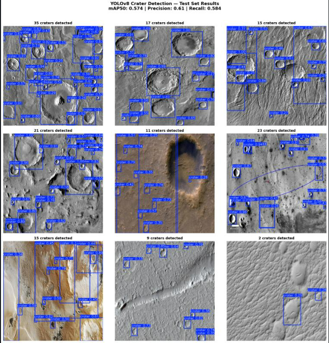
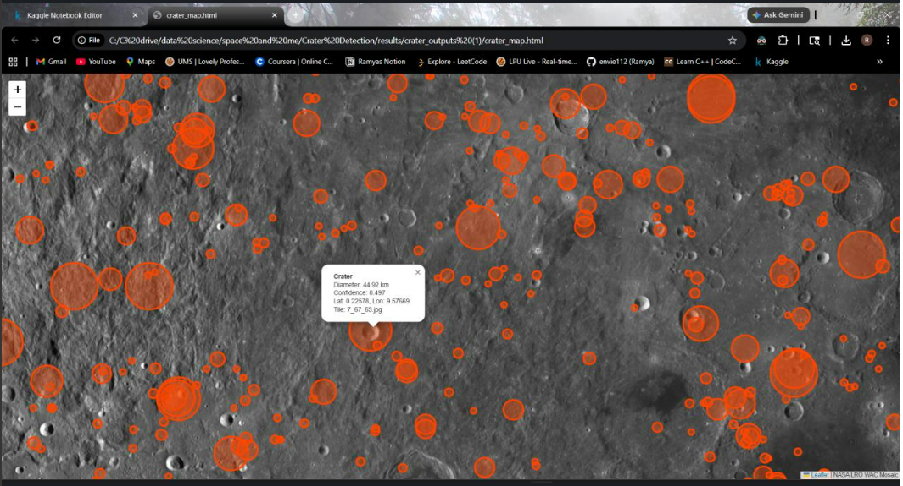

# 🌑 Crater Detection on Planetary Surfaces
### Computer Vision · Geospatial ML · NASA Imagery
 
An end-to-end pipeline that automatically detects impact craters on the Moon using real NASA orbital imagery — from raw satellite tiles to a fully interactive georeferenced map.
 
[](https://www.kaggle.com/code/ramya18145/notebook-crater-detection/edit/run/314038070#Dataset-&-Model-Training)
 
---
 
## The Story
 
This project didn't go in a straight line — and that's worth being honest about.
 
**Attempt 1 — Build a custom dataset from scratch.**
The original plan was ambitious: download NASA LRO WAC Mosaic tiles directly, use the LROC crater catalogue as ground truth labels, and train a model on real NASA data end-to-end. In practice this ran into serious problems — resolution mismatches between the imagery and catalogue, severe class imbalance (most tiles were empty sky with very few craters), and labels that didn't align cleanly at the tile level.
 
**Attempt 2 — Switch to a properly labelled dataset.**
Rather than force a broken pipeline, the smarter call was to find a dataset that was already clean and annotated. The [Martian/Lunar Crater Detection Dataset](https://www.kaggle.com/datasets/lincolnzh/martianlunar-crater-detection-dataset) (lincolnzh, Kaggle) provided properly formatted YOLO bounding box annotations across 143 images. YOLOv8s was fine-tuned on this and hit solid metrics.
 
**Phase 2 — Come back to NASA data, this time for inference.**
With a trained model in hand, the original NASA LRO imagery became the target rather than the training source. The model was deployed across 6,796 real lunar tiles covering the full surface — detecting 10,727 craters, converting every pixel bounding box to real lunar latitude/longitude, and exporting results as GeoJSON and an interactive map. The detections were then validated against expected planetary science theory using a Size-Frequency Distribution analysis.
 
---
 
## Results
 
| Metric | Score |
|--------|-------|
| Precision | 0.674 |
| Recall | 0.603 |
| mAP50 | **0.617** |
| F1 Score | 0.636 |
| Craters detected | **10,727** |
| Lunar tiles processed | 6,796 |
| Diameter range | 1.1 km — 85.3 km |
| Median diameter | 7.6 km |
 


 
---
 
## Size-Frequency Distribution Validation
 
The key question after running inference at scale is: *are the detections real, or just noise?*
 
One way to check is the Size-Frequency Distribution (SFD). In planetary science, crater populations follow a power-law distribution on a log-log scale — smaller craters accumulate faster than large ones, so there should always be far more small craters than large ones. This is a well-established empirical pattern across the Moon, Mars, and other rocky bodies.
 
The SFD plot below shows the detected crater population matches this expected distribution closely. The rolloff at small diameters (~1–2 km) is not a model failure — it reflects the resolution limit of the LRO WAC tiles, which cannot resolve craters below a certain angular size. This is a known and expected observational effect.
 

 
---
 
## Georeferencing
 
Standard YOLO inference outputs pixel-level bounding boxes on image tiles. To make these scientifically meaningful, each detection was converted to real lunar coordinates using XYZ Mercator math.
 
Each NASA LRO WAC tile has a known position in a Mercator-projected grid. The tile's x/y/z indices define its geographic bounds. The center of each bounding box was mapped from pixel space → tile-relative fractional coordinates → Mercator projected coordinates → lunar latitude/longitude.
 
Results were exported as GeoJSON (`results/craters.geojson`) and visualised on an interactive Folium map (`results/crater_map.html`) with scaled circle markers proportional to crater diameter and clickable metadata per detection.
 
> **Note on GeoJSON viewers:** `craters.geojson` uses Moon-centric coordinates, not Earth's WGS84 system. Standard GeoJSON viewers (like geojson.io) will misplace detections on Earth's map. Use `crater_map.html` for correct visualisation — it uses NASA LRO imagery as the basemap.
 
---
 
## Debugging: CUDA GPU Compatibility
 
Training on Kaggle with a T4 GPU hit a PyTorch–CUDA architecture mismatch — the environment had binaries compiled for `sm_75` (T4) but the CUDA toolkit was resolving to `sm_60`. This caused silent failures during model compilation. Fixed by pinning the correct PyTorch build and verifying the CUDA compute capability matched the runtime environment before training.
 
---
 
## Repository Structure
 
```
Crater-Detection/
│
├──  crater_detection_pipeline.ipynb      ← YOLOv8 fine-tuning + Full inference + georeferencing pipeline
│
├── results/
│   ├── crater_map.html                   ← Interactive Folium map (open in browser)
│   ├── craters.geojson                   ← Georeferenced detections (Moon coordinates)
│   ├── LROCCraters.csv                   ← Detection output with lat/lon/diameter
│   └── sfd_plot.png                      ← Size-frequency distribution validation
│
├── assets/
│   └── test_results_grid.png             ← YOLOv8 test set detections
│
├── data/                                 ← Dataset config and references
├── crater_detector_best.pt               ← Trained model weights
├── requirements.txt
├── crater_journal.docx
└── README.md
```
 
---
 
## How to Run
 
**Install dependencies**
```bash
pip install -r requirements.txt
```
 
**Run inference on a single image**
```python
from ultralytics import YOLO
model = YOLO('crater_detector_best.pt')
results = model('your_image.jpg', conf=0.25)
results[0].show()
```
 
**Full pipeline (Kaggle recommended — T4 GPU)**
 
Open `crater_detection_pipeline.ipynb` on Kaggle using the badge at the top. The notebook runs the full tile download → inference → georeferencing → map export pipeline.
 
---
 
## Dataset
 
- **Source:** [Martian/Lunar Crater Detection Dataset](https://www.kaggle.com/datasets/lincolnzh/martianlunar-crater-detection-dataset) — lincolnzh, Kaggle
- **Training images:** 98 · **Validation:** 26 · **Test:** 19
- **Annotation format:** YOLO bounding boxes
- **Inference target:** NASA LRO WAC Mosaic (6,796 tiles, full lunar surface)
---
 
## Why Crater Detection Matters
 
Crater counting is one of the primary methods planetary scientists use to estimate the age of a surface — more craters means older, less geologically active terrain. Automating this process with computer vision makes it faster, more consistent, and scalable to the full planetary surface rather than manually sampled regions.
 
---
 
## Tech Stack
 
`Python` · `PyTorch` · `YOLOv8 (Ultralytics)` · `Folium` · `GeoJSON` · `Pandas` · `NumPy` · `Kaggle (T4 GPU)` · `NASA LRO WAC Mosaic`
 
---
 
## Author
 
Built as a computer vision + geospatial portfolio project using real NASA/ESA planetary imagery.
Feb 2026 – Apr 2026
 
